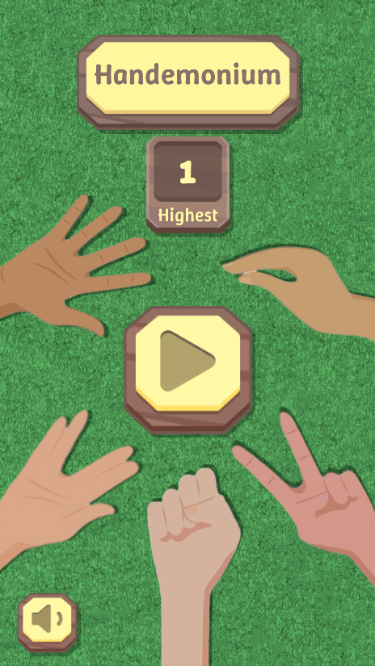
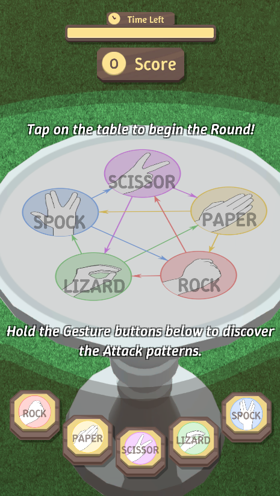
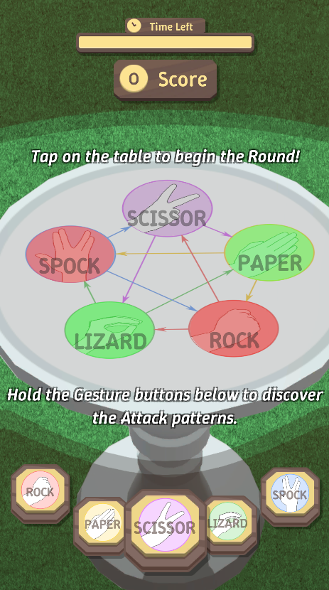
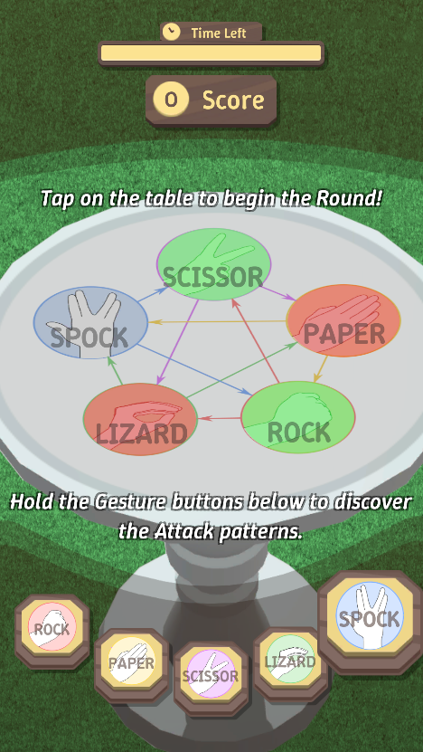
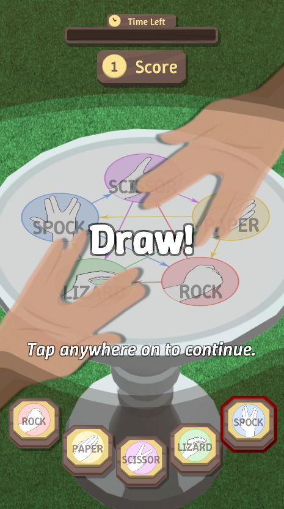
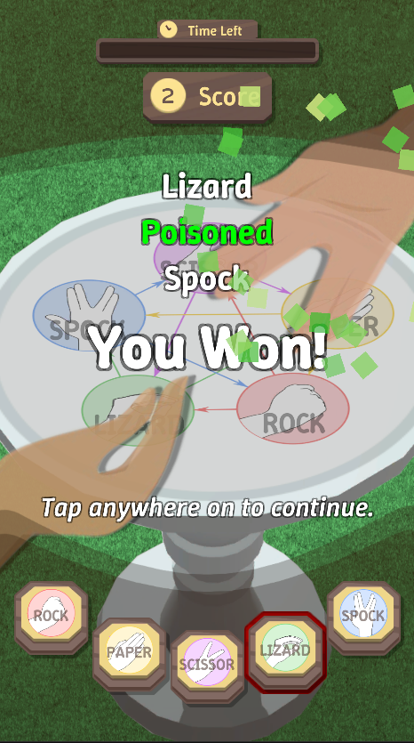
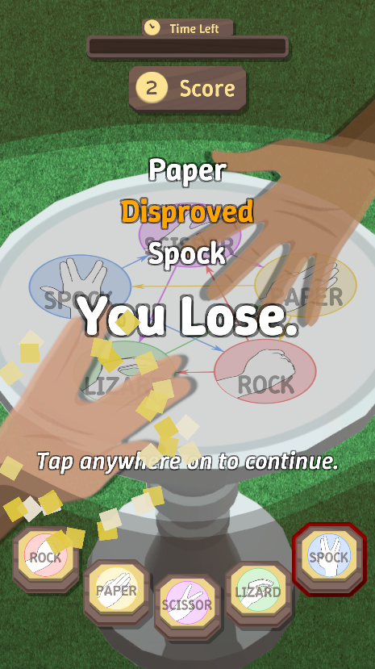

# Handemonium (Unity)

## Overview
This project implements a **Rock-Paper-Scissors-Lizard-Spock** game in Unity using a structured architecture with the **Service Locator** pattern, **Abstract Singletons**, **State Pattern**, **Strategy Pattern**, and **Scriptable Objects**.

## Architecture

### Service Locator Pattern
The game architecture is built using the **Service Locator Pattern**, ensuring a modular and scalable structure. The core services implement the `IService` interface, which provides two key lifecycle methods:
- `Start()`
- `OnDestroy()`

The following are the services that implement IService and are managed by the **Bootstrap** class:
- **GameManager** (`IGameService`) - Manages the game state.
- **RoundManager** (`IRoundService`) - Controls the round-based flow of the game.
- **SceneService** (`ISceneService`) - Handles scene transitions.
- **HighscoreService** (`IHighscore`) - Manages high scores.

These services are **not MonoBehaviours**, so they do not call `Start()` on their own. Instead, **Bootstrap**, a MonoBehaviour, registers and initializes all services synchronously in `Awake()`, triggering their `Start()` methods. Once initialized, **SceneService** is used to transition the player to the **Game Scene**.

### Singleton Pattern
An **abstract Singleton** inheriting from `MonoBehaviour` is used to implement controllers and scene-based managers. The following classes inherit from this abstract singleton:
- **Bootstrap**
- **UIManager**
- **MainMenuController**
- **InGameController**
- **AudioManager**

## Game Flow
The game follows a structured **state-driven flow** with two main controllers:

### GameManager - State Pattern
`GameManager` cycles through three states:
1. **Bootstrap** (initialization)
2. **MainMenu** (homepage)
3. **InGame** (gameplay session)

Both **MainMenuController** and **InGameController** listen for `GameManager`'s state changes and update UI elements and environment accordingly.

### RoundManager - State Pattern
`RoundManager` manages the individual round flow with the following states:
- **Idle**: Player is not in the game view.
- **Begin**: The round starts.
- **End**: The round timer expires.
- **Result**: Determines the winner and updates the score.

From **Result** state:
- If **Win** or **Draw**, transition to **Begin**.
- Otherwise, transition to **Idle**.

**InGameController** listens for `RoundManager` state changes and manages in-game behavior, including **UI, environment, player input, AI behavior, and score control**.

## AI System - Strategy Pattern
The game is played between a human player and an AI opponent. Both `ManualPlayer` and `AIPlayer` inherit from `BasePlayer`, implementing common methods:
- `MakeChoice()`
- `ShowHand()`
- `HideHand()`

The **AIPlayer** follows a **Strategy Pattern** to decide its move, choosing from two AI strategies:
1. **AIStrategyPureRandom** - Picks a gesture randomly.
2. **AIStrategyWeightedRandom** - Prefers certain gestures based on weighting.

Both strategies implement `IAIStrategy` with the method:
- `ChooseGesture()`

The AI selects one of these strategies on `Awake()` and follows it throughout the game.

## Gestures - Scriptable Objects
Each gesture (Rock, Paper, Scissors, Lizard, Spock) is implemented as a **Scriptable Object** with the following fields:
- `GestureType` (Enum)
- `AttackInfo` (List of gestures this type can defeat)
- `Sprite`
- `AttackParticles`

This structure allows for flexibility in modifying gesture behaviors.

## Flow Diagram

`pending...`

## Screenshots

